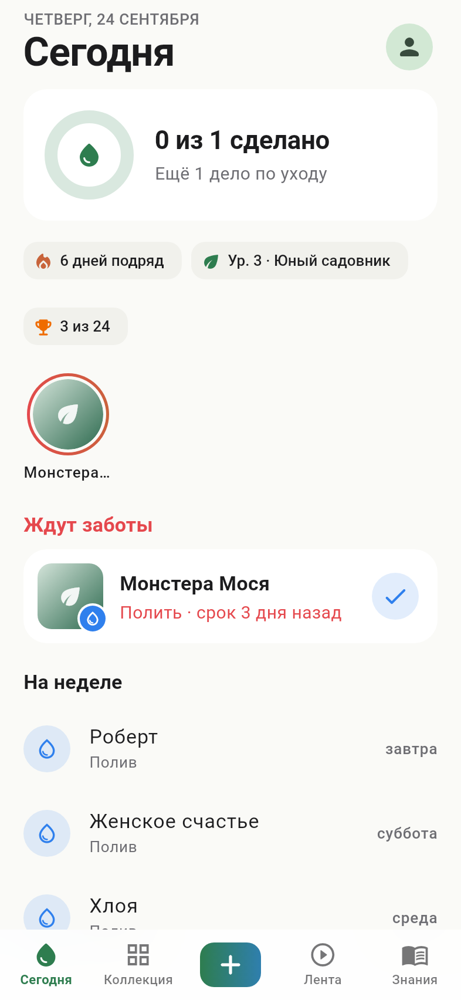
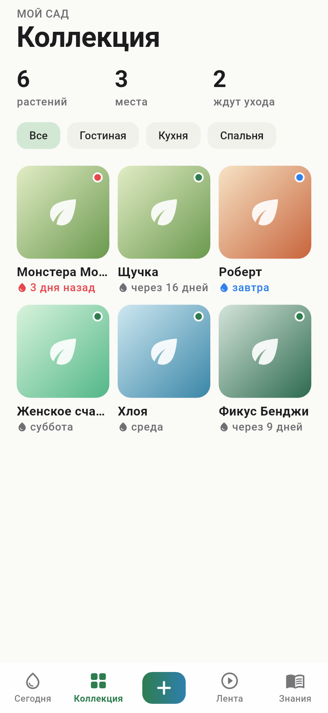
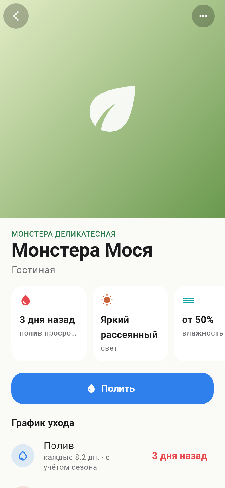
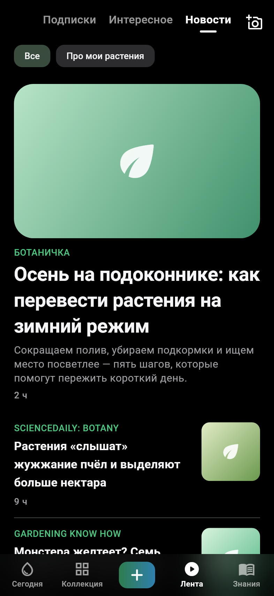
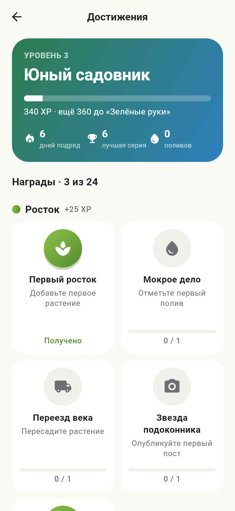

# Мой сад — мобильное приложение (Flutter, iOS + Android)

Коллекция растений, напоминания о поливе, база знаний, лента постов и новостей, достижения.
Архитектура и дизайн — в [docs/plant-app](../docs/plant-app/ARCHITECTURE.md).

| Сегодня | Коллекция | Растение | Лента | Новости | Достижения |
|---|---|---|---|---|---|
|  |  |  |  |  |  |

## Быстрый старт (демо-режим, без сервера)

```bash
cd mobile
flutter pub get
flutter run            # данные в памяти, заполнены примером
```

## Подключение к Supabase

1. Проект `intskfwuljzaaghoaqfx` уже развёрнут: применены все миграции из `supabase/migrations`
   (имена файлов совпадают с версиями в истории миграций проекта) и `seed.sql`.
   Для нового проекта примените миграции и стартовые данные (один раз, на чистой базе):
   ```bash
   DATABASE_URL='postgresql://postgres:<пароль>@db.<project-ref>.supabase.co:5432/postgres' \
     scripts/apply-remote.sh --seed
   ```
   или через Supabase CLI: `supabase link --project-ref <ref> && supabase db push`, затем выполнить
   `supabase/seed.sql` в SQL Editor.
2. Создайте `mobile/config/dev.json` по образцу `config/example.json` (файл в `.gitignore`):
   ```json
   { "SUPABASE_URL": "https://<project-ref>.supabase.co", "SUPABASE_PUBLISHABLE_KEY": "sb_publishable_..." }
   ```
3. Запуск: `flutter run --dart-define-from-file=config/dev.json`.

Publishable-ключ предназначен для клиента — доступ к данным ограничивают RLS-политики.
Секретный ключ (`service_role`) и пароль базы в приложение и репозиторий не попадают никогда.

## Сбор новостей

Edge Function `supabase/functions/news-ingest` читает RSS/Atom-ленты из таблицы `news_sources`,
сохраняет заголовок, выдержку, картинку и ссылку (без полного текста) и отмечает упомянутые
виды из базы знаний. В проекте `intskfwuljzaaghoaqfx` функция развёрнута и запускается
`pg_cron` каждый час в :17 (задача `news-ingest-hourly`).

Для нового проекта:
1. `supabase functions deploy news-ingest --no-verify-jwt`
2. `select vault.create_secret('https://<project-ref>.supabase.co', 'project_url');`
3. Применить миграции — `*_news_schedule.sql` создаст секрет вызова в Vault и расписание.

Источники добавляются строкой в `news_sources`; неработающая лента пишет ошибку в `last_error`.
Ответы последних запусков: `select * from net._http_response order by created desc limit 5;`

## Распознавание растений по фото

Бесплатно и на устройстве: открытая модель Google AIY Vision «plants V1» (TFLite, 2102 вида,
Apache-2.0). Приложение один раз скачивает её (5 МБ) из публичного бакета `ml-models` проекта
Supabase и дальше распознаёт без сети и ключей. Результат сопоставляется с базой знаний:
точный вид, вид того же рода («уточните») или латинское название, если вида в базе нет.

Модель обучена в основном на дикорастущих растениях: из 10 видов стартовой базы точно узнаёт
монстеру, алоэ и толстянку, фикус — до рода. Для комнатных растений точнее бесплатный
Pl@ntNet API (500 запросов в день, регистрация на my.plantnet.org) — его можно добавить
серверной функцией с ключом в секретах Supabase.

Загрузка модели в новый проект: развернуть `supabase/functions/fetch-plant-model` и вызвать её
с заголовком `x-cron-secret` (секрет `news_ingest_secret` из Vault).

## Проверки

```bash
flutter analyze && flutter test                      # приложение
../scripts/check-migrations.sh                       # миграции + дымовой тест на локальном Postgres
node --experimental-strip-types --test ../supabase/functions/news-ingest/feed.test.ts
```
